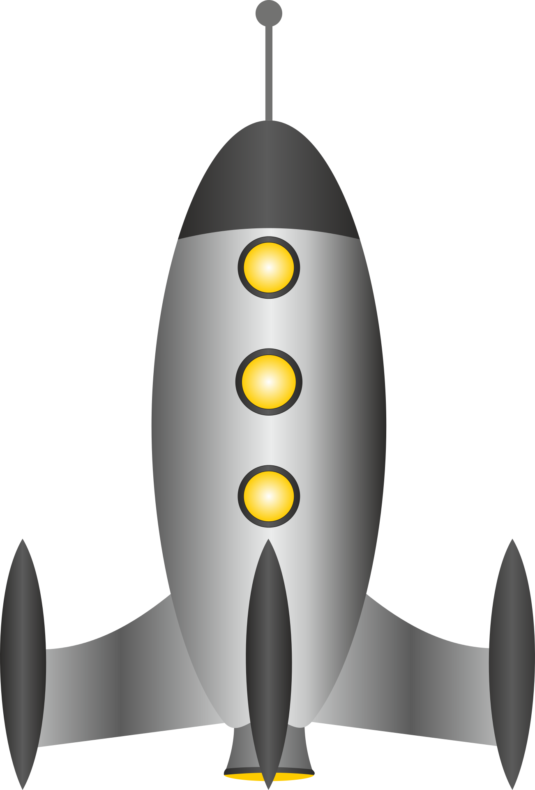

# Space Shooter Game



Welcome to the Space Shooter game! This project is a simple yet engaging space shooter game developed using Pygame. 

## Table of Contents

- [Introduction](#introduction)
- [Features](#features)
- [Installation](#installation)
- [How to Play](#how-to-play)
- [Screenshots](#screenshots)
- [Contributing](#contributing)
- [License](#license)

## Introduction

The Space Shooter game is a fun and interactive game where players control a spaceship to shoot down enemies and avoid obstacles. It is built using the Pygame library and showcases basic game development concepts.

## Features

- **Player Control:** Move the spaceship using arrow keys.
- **Shooting:** Shoot bullets to destroy enemies.
- **Enemies:** Randomly spawning enemies.
- **Score:** Track the player's score.
- **Sound Effects:** Enjoy sound effects for shooting and explosions.

## Installation

To run the game, you need to have Python and Pygame installed on your system. Follow these steps to set up the game:

1. Clone the repository:
    ```sh
    git clone https://github.com/MikePagorb/Space_Shooter.git
    cd spaceshooter
    ```

2. Install the required dependencies:
    ```sh
    pip install -r requirements.txt
    ```

3. Run the game:
    ```sh
    python main.py
    ```

## How to Play

- Use the arrow keys to move the spaceship.
- Press the spacebar to shoot bullets.
- Avoid getting hit by enemies.
- Destroy enemies to increase your score.

## Screenshots


*In-game action showcasing the spaceship shooting at enemies.*


*The player dodging incoming enemy ships.*

## Contributing

Contributions are welcome! If you have any ideas or improvements, feel free to fork the repository and submit a pull request. 

## License

Distributed under the MIT License. See `LICENSE` for more information.
